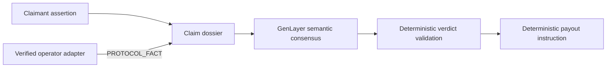
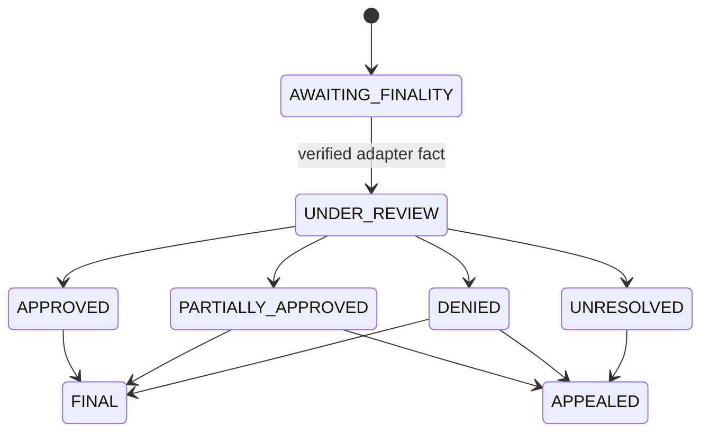

# SLAIV

SLAIV is a GenLayer-native slashing-coverage adjudication protocol. It binds immutable coverage terms, separates claimant assertions from protocol facts, uses GenLayer consensus for semantic judgment, and applies deterministic settlement rules.

## Architecture



SLAIV separates protocol-fact attestation from consensus adjudication. Claimants cannot establish protocol finality, and the protocol authority cannot determine eligibility or payout. Each policy names a `subject_network`; protocol evidence from another network is rejected before review. The authority is a narrow trusted adapter role; the design is not described as oracle-free.

Deterministic code controls schemas, authorization, policy membership, bindings, finality, bounds, state transitions and payout arithmetic. GenLayer is necessary for semantic incident classification, exclusions, evidence interpretation and eligible-loss judgment. An uncovered event may be truthfully classified and denied, but can never be approved or paid.

## State machine



The browser uses an injected wallet through `genlayer-js@1.1.8`, waits for transaction finality, verifies successful GenVM execution, and refreshes authoritative contract state. It never manufactures protocol facts; authority operations use [`scripts/record-protocol-finality.mjs`](scripts/record-protocol-finality.mjs).

## Current release

- Studionet contract: `0x7BCD17b76a9c6e3daA9f12a7b7E50Cfc83AF8eA0`
- Deployment tx: `0x771f5ad3ac3111395761c008d7019ebe91e5f59991635343b3b793a3a1058fd4`
- Contract source commit: `edb48853c3f4de10c0b2bab2d766763bd8487162`
- Contract SHA-256: `d00542cc83511cb595c9459fb74874e18b14908568c3b3b13cfa1a01abd8f943`
- Direct Mode: 67 passed
- Frontend tests: 24 passed
- Source match and preflight: PASS

See [the reviewer dossier](SUBMISSION_READINESS.md), [deployment record](docs/DEPLOYMENT.md), [security boundaries](docs/SECURITY.md), and [protocol adapter guide](docs/PROTOCOL_ADAPTER.md).

## Verify locally

```bash
npm install
npm test
npm run lint
npm run typecheck
npm run build
python scripts/preflight.py
```
