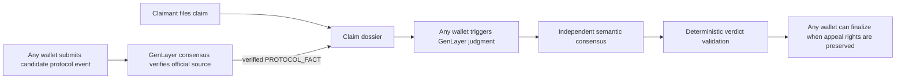
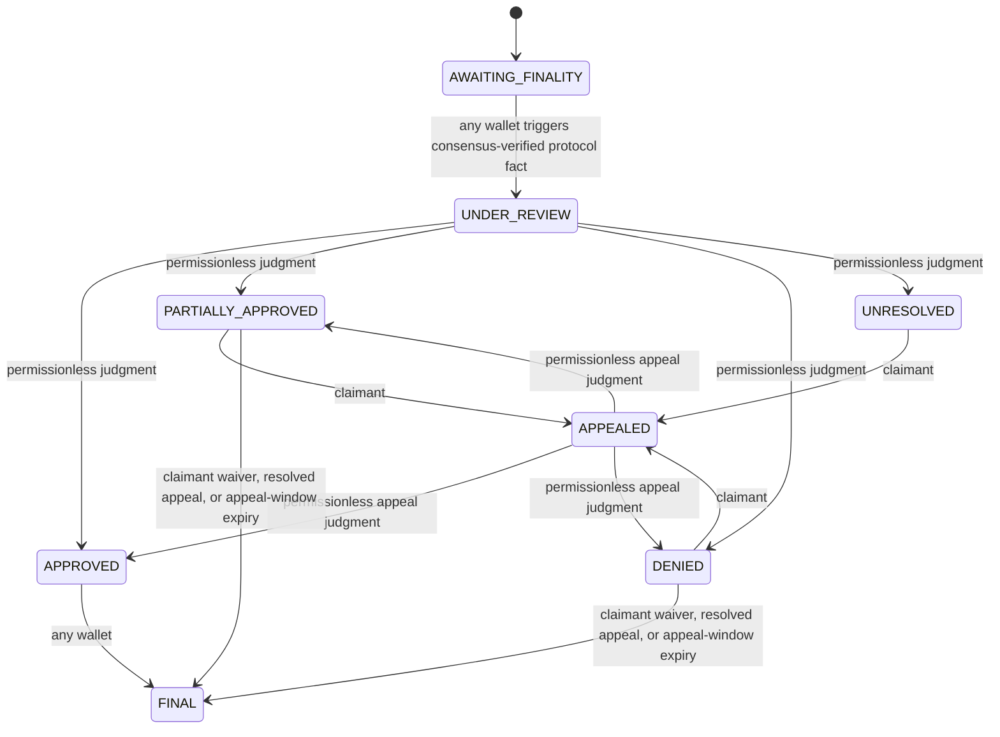

# SLAIV

SLAIV is a GenLayer-native slashing-coverage adjudication protocol. It binds immutable coverage terms, separates identity-bound claimant actions from public protocol triggers, uses GenLayer consensus to verify protocol facts and adjudicate semantic policy questions, and applies deterministic settlement rules.

## Permissionless architecture



The caller is never the adjudicator. A wallet may trigger protocol verification, judgment, appeal review, or finalization, but it cannot choose the verified protocol facts, eligibility, eligible loss, or payout. GenLayer validators independently reproduce the relevant source-grounded work and must agree on settlement-critical fields.

Identity-bound rights remain identity-bound: a user creates a policy for their own wallet, the policy holder files the claim, claimant assertions are attributable to the claimant, and only the claimant chooses whether to appeal. Public-source evidence, protocol-event verification, GenLayer judgment, appeal judgment, and eligible finalization are permissionless.

## State machine



For protocol finality, the browser or CLI submits only a candidate GenLayer event/transaction ID and an official explorer record. The Intelligent Contract fetches that official source inside GenLayer non-deterministic execution; leader and validators independently derive the finality, validator, network, event class, event ID, and event time. State advances only when the verified result satisfies the immutable policy boundary.

## Permissionless v3 candidate

Development is isolated on the `permissionless-v3` branch until contract tests, frontend tests, source checks, deployment, and a fresh live lifecycle are verified. **Do not treat the historical production address below as the v3 contract.**

Current historical production release:

- Studionet contract: `0x7BCD17b76a9c6e3daA9f12a7b7E50Cfc83AF8eA0`
- Deployment tx: `0x771f5ad3ac3111395761c008d7019ebe91e5f59991635343b3b793a3a1058fd4`
- Frozen contract source commit: `edb48853c3f4de10c0b2bab2d766763bd8487162`
- Contract SHA-256: `d00542cc83511cb595c9459fb74874e18b14908568c3b3b13cfa1a01abd8f943`

Those values describe the previous authority-gated release only. The v3 deployment metadata must be filled in after a new permissionless contract is actually deployed and source-matched.

## Trigger finality verification from CLI

Any funded/configured GenLayer wallet may submit a candidate:

```bash
npm run verify:finality -- --claim-id clm_... --event-id 0x<64-hex>
```

Optionally supply an exact official explorer record:

```bash
npm run verify:finality -- --claim-id clm_... --event-id 0x<64-hex> --reference https://explorer-studio.genlayer.com/tx/0x<64-hex>
```

The CLI does not attest that the event is final. It only submits the candidate; the Intelligent Contract and GenLayer validators perform verification.

## Verify locally

```bash
npm install
npm test
npm run lint
npm run typecheck
npm run build
pytest tests/direct -v
python scripts/preflight.py
```

See [REVIEWER_TESTING.md](REVIEWER_TESTING.md) for the intended reviewer flow. Historical deployment evidence remains in [SUBMISSION_READINESS.md](SUBMISSION_READINESS.md) until the new v3 deployment is verified.
