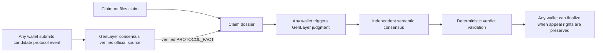
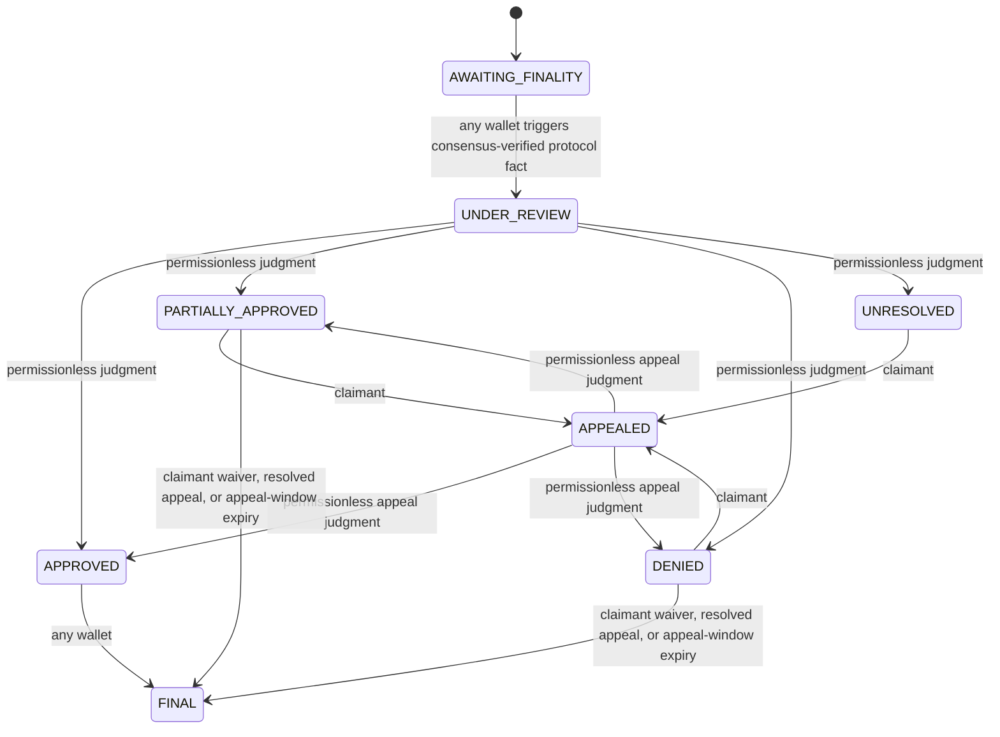

# SLAIV

SLAIV is a GenLayer-native slashing-coverage adjudication protocol. It binds immutable coverage terms, separates identity-bound claimant actions from public protocol triggers, uses GenLayer consensus to verify protocol facts and adjudicate semantic policy questions, and applies deterministic settlement rules.

## Permissionless architecture



The caller is never the adjudicator. A wallet may trigger protocol verification, judgment, appeal review, or finalization, but it cannot choose the verified protocol facts, eligibility, eligible loss, or payout. GenLayer validators independently reproduce the relevant source-grounded work and must agree on settlement-critical fields.

Identity-bound rights remain identity-bound: a user creates a policy for their own wallet, the policy holder files the claim, claimant assertions are attributable to the claimant, and only the claimant chooses whether to appeal. Public-source evidence, protocol-event verification, GenLayer judgment, appeal judgment, and eligible finalization are permissionless.

## State machine



For protocol finality, the browser or CLI submits only a candidate GenLayer transaction hash -- no source URL. The Intelligent Contract resolves the official GenLayer node RPC endpoint for the policy's network itself and queries it inside GenLayer non-deterministic execution; leader and validators independently re-query it and deterministically derive the finality, validator, network, event class, event ID, and event time from its structured fields. State advances only when the verified result satisfies the immutable policy boundary. See `docs/PROTOCOL_ADAPTER.md` for the exact RPC method and per-network verification status.

## Permissionless v3 (current release)

The current release is the permissionless v3 architecture: any wallet may trigger protocol verification and GenLayer review, while claimant identity rights remain claimant-only.

- Studionet contract: `0xC8DC9930efA7276280E2E23BC59038420e97F747`, deployment tx `0xe4b87aa75d3952f054dc319e3929b0f1d3808ef612a733d43bef4fd593d89737`, frozen source commit `f62614693d421c115579d82d082d8319995774aa`. `SOURCE MATCH: PASS`, `PREFLIGHT: PASS` -- see `docs/DEPLOYMENT.md` for the full record. Supports `MISSED_EXECUTION_WINDOW` only; `MISSED_APPEAL_WINDOW` remains removed because the official RPC does not expose validator-bound proof.
- Evidence-slot DoS fixed: `PUBLIC_SOURCE` evidence now has a strict total cap plus a per-wallet cap, `PROTOCOL_FACT` and appeal evidence each have their own reserved slot, and duplicate detection uses canonical fields, not just the caller-chosen `evidence_id`. No combination of outsider evidence submissions can block protocol-fact recording or a claimant's later appeal.
- Public-source fetch selection is priority-ordered (appeal evidence, then claimant-submitted evidence, then everyone else's), so an outsider filling every pre-review `PUBLIC_SOURCE` slot can never crowd the claimant's or appellant's own relevant source out of the bounded fetch window judgment actually reads.
- Judgment sees real evidence: claimant statements are stored as bounded text in contract state (not just a discarded hash), and `PUBLIC_SOURCE` references are independently retrieved by the leader and every validator via `gl.nondet.web` at judgment time, bounded in count and response size, failing safe on fetch failure. Public-source URLs are validated beyond a bare `https://` prefix (rejects missing hosts, embedded credentials, control characters, and common private-network host literals), and `policy_commitment`/`evidence_commitment` must be proper 64-hex sha256 digests.
- `record_appeal`'s evidence argument is canonicalized from the same explicit field allowlist `append_evidence` uses, so injected/unknown fields can never reach the appeal-review prompt.
- Settlement is deterministic: `loss_fraction_bps` is constrained to a fixed band and `eligible_loss` is computed in contract code, never trusted as a free-form LLM output. Consensus agreement (both first judgment and appeal review) compares only settlement-critical fields, so reasoning-text wording differences never block a legitimate verdict. An `UNRESOLVED` appeal no longer strands the claim -- `review_appeal` can be re-triggered until it actually resolves.
- `verify_protocol_finality`'s live RPC path was previously verified end-to-end (on a now-superseded deployment carrying identical contract logic): a real signed call reached the official RPC and every consensus node independently derived the identical fail-closed result for a real, finalized, non-incident transaction. It has not yet been re-verified with a fresh signed call against the current address -- a prior attempt used `genlayer write --args`, which is known to corrupt hex transaction hashes before they reach the contract, and reverted at an earlier format check instead. See `docs/DEPLOYMENT.md` for the full record and the correct command to re-verify.
- Full live-transaction test table for the previous release (every row mapped to what it tested and the observed result): `docs/DEPLOYMENT.md`, section "Live release proof (`0x283ae69159d7eE8b2c05981139cF493d8fD730D8`, superseded)". The current release's deployment verification (source match, preflight, and the full local test/lint/typecheck/build gate) is recorded in the same file under "Deployment verification (current release, ...)".
- Historical production release: Studionet contract `0x7BCD17b76a9c6e3daA9f12a7b7E50Cfc83AF8eA0`, deployment tx `0x771f5ad3ac3111395761c008d7019ebe91e5f59991635343b3b793a3a1058fd4`, frozen source commit `edb48853c3f4de10c0b2bab2d766763bd8487162`. This was the authority-gated v2 release, now fully superseded by the permissionless v3 release above.

## Trigger finality verification from CLI

Any funded/configured GenLayer wallet may submit a candidate:

```bash
npm run verify:finality -- --claim-id clm_... --event-id 0x<64-hex>
```

The CLI does not attest that the event is final. It only submits the candidate; the Intelligent Contract and GenLayer validators perform verification against the official RPC.

## Verify locally

```bash
npm install
npm test
npm run lint
npm run typecheck
npm run build
pytest tests/direct -v
python scripts/preflight.py
```

See [REVIEWER_TESTING.md](REVIEWER_TESTING.md) for the intended reviewer flow. Historical deployment evidence remains in [SUBMISSION_READINESS.md](SUBMISSION_READINESS.md) until the new v3 deployment is verified.
