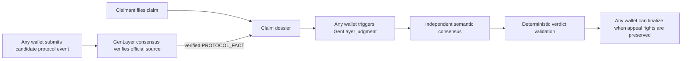
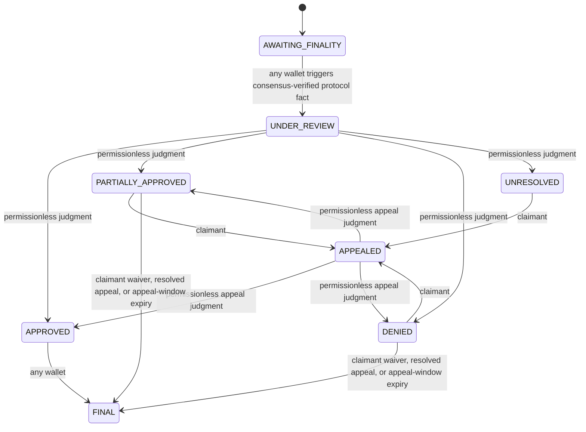

# SLAIV

SLAIV is a GenLayer-native slashing-coverage adjudication protocol. It binds immutable coverage terms, separates identity-bound claimant actions from public protocol triggers, uses GenLayer consensus to verify protocol facts and adjudicate semantic policy questions, and applies deterministic settlement rules.

## Permissionless architecture



The caller is never the adjudicator. A wallet may trigger protocol verification, judgment, appeal review, or finalization, but it cannot choose the verified protocol facts, eligibility, eligible loss, or payout. GenLayer validators independently reproduce the relevant source-grounded work and must agree on settlement-critical fields.

Identity-bound rights remain identity-bound: a user creates a policy for their own wallet, the policy holder files the claim, claimant assertions are attributable to the claimant, and only the claimant chooses whether to appeal. Public-source evidence, protocol-event verification, GenLayer judgment, appeal judgment, and eligible finalization are permissionless.

## State machine



For protocol finality, the browser or CLI submits only a candidate GenLayer transaction hash -- no source URL. The Intelligent Contract resolves the official GenLayer node RPC endpoint for the policy's network itself and queries it inside GenLayer non-deterministic execution; leader and validators independently re-query it and deterministically derive the finality, validator, network, event class, event ID, and event time from its structured fields. State advances only when the verified result satisfies the immutable policy boundary. See `docs/PROTOCOL_ADAPTER.md` for the exact RPC method and per-network verification status.

## Permissionless v3 candidate

Development is isolated on the `permissionless-v3` branch (draft PR #5, not merged to `main`). A permissionless v3 contract has been deployed to Studionet and source-matched, but the public frontend still points at the historical authority-gated release below until this branch is reviewed and merged.

- v3 Studionet contract (pending merge): `0x95FCEcA657dCfc87F140B616e79fD9D04700bBA9` -- see `docs/DEPLOYMENT.md` for the full record, source hash, and live proof. Supports `MISSED_EXECUTION_WINDOW` only; `MISSED_APPEAL_WINDOW` was found to be validator-unbound in an earlier audit deployment and was removed (see `docs/DEPLOYMENT.md`, "Why the prior deployment was superseded").
- Current historical production release: Studionet contract `0x7BCD17b76a9c6e3daA9f12a7b7E50Cfc83AF8eA0`, deployment tx `0x771f5ad3ac3111395761c008d7019ebe91e5f59991635343b3b793a3a1058fd4`, frozen source commit `edb48853c3f4de10c0b2bab2d766763bd8487162`. This is the authority-gated v2 release and remains the live production contract until v3 is merged and switched over.

## Trigger finality verification from CLI

Any funded/configured GenLayer wallet may submit a candidate:

```bash
npm run verify:finality -- --claim-id clm_... --event-id 0x<64-hex>
```

The CLI does not attest that the event is final. It only submits the candidate; the Intelligent Contract and GenLayer validators perform verification against the official RPC.

## Verify locally

```bash
npm install
npm test
npm run lint
npm run typecheck
npm run build
pytest tests/direct -v
python scripts/preflight.py
```

See [REVIEWER_TESTING.md](REVIEWER_TESTING.md) for the intended reviewer flow. Historical deployment evidence remains in [SUBMISSION_READINESS.md](SUBMISSION_READINESS.md) until the new v3 deployment is verified.
