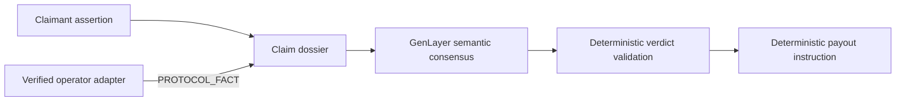
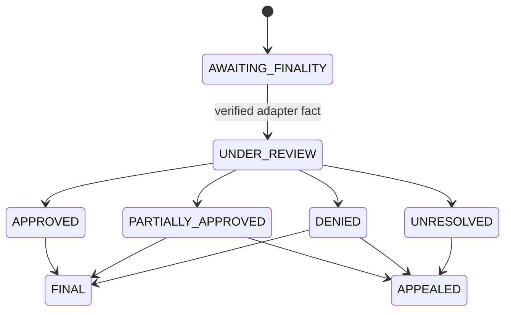

# SLAIV

SLAIV is a GenLayer-native slashing-coverage adjudication protocol. It binds immutable coverage terms, separates claimant assertions from protocol facts, uses GenLayer consensus for semantic judgment, and applies deterministic settlement rules.

## Architecture



SLAIV separates protocol-fact attestation from consensus adjudication. Claimants cannot establish protocol finality, and the protocol authority cannot determine eligibility or payout. The authority is a narrow trusted adapter role; the design is not described as oracle-free.

Deterministic code controls schemas, authorization, policy membership, bindings, finality, bounds, state transitions and payout arithmetic. GenLayer is necessary for semantic incident classification, exclusions, evidence interpretation and eligible-loss judgment. An uncovered event may be truthfully classified and denied, but can never be approved or paid.

## State machine



The browser uses an injected wallet through `genlayer-js@1.1.8`, waits for transaction finality, verifies successful GenVM execution, and refreshes authoritative contract state. It never manufactures protocol facts; authority operations use [`scripts/record-protocol-finality.mjs`](scripts/record-protocol-finality.mjs).

## Current release

- Studionet contract: `0x8B1Db5604D2dDDa6741fB9C7168EC7fA468FD440`
- Deployment tx: `0xa9faac339e157bf428633d807906a033d830f2e17a4050c52f6b1b1832ef477a`
- Contract source commit: `4e53e9ba210db7b0bd90635cd6ae037d9e574da5`
- Contract SHA-256: `afde26ecf341664241c76d9d6ade399beb6365b4c17a70b6a1f37ae111032e96`
- Direct Mode: 60 passed
- Frontend tests: 22 passed
- Source match and preflight: PASS

See [the reviewer dossier](SUBMISSION_READINESS.md), [deployment record](docs/DEPLOYMENT.md), [security boundaries](docs/SECURITY.md), and [protocol adapter guide](docs/PROTOCOL_ADAPTER.md).

## Verify locally

```bash
npm install
npm test
npm run lint
npm run typecheck
npm run build
python scripts/preflight.py
```
